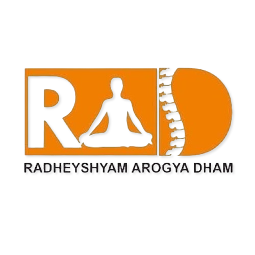

<div align="center">

# 🌿 Revive by Radheyshyam Arogya Dham
### *Advanced Non-Medicinal Acupressure & Naturopathic Pain Management*

[](https://pipoza-dev.github.io/revive/)
[](#-liquid-glass-design-system)
[](#-about-dr-amarkant-gaur)
[](https://www.instagram.com/pipozadev.studio)

<br/>



<p align="center">
  <b>Sector 62, Noida, Uttar Pradesh, India</b><br/>
  <i>Treating acute and chronic back, neck, joint, and nerve pain through targeted acupressure and naturopathy — addressing the structural cause, not just masking the symptom.</i>
</p>

[Explore Live Website](https://pipoza-dev.github.io/revive/) • [Dr. Amarkant Gaur](https://pipoza-dev.github.io/revive/dr-amarkant-gaur) • [Athletes Supported](https://pipoza-dev.github.io/revive/athletes) • [Contact & Visit](https://pipoza-dev.github.io/revive/contact)

</div>

---

## 📋 Table of Contents

- [🌟 Clinical Philosophy](#-clinical-philosophy)
- [👨‍⚕️ About Dr. Amarkant Gaur](#️-about-dr-amarkant-gaur)
- [🏅 Elite Athletes Supported](#-elite-athletes-supported)
- [💎 Liquid Glass Design System](#-liquid-glass-design-system)
- [⚡ Key Features & Engineering](#-key-features--engineering)
- [📂 Project Architecture](#-project-architecture)
- [🚀 Clean URL Routing & Deployment](#-clean-url-routing--deployment)
- [📞 Direct Clinic Contact](#-direct-clinic-contact)
- [🎨 Crafted with Care](#-crafted-with-care)

---

## 🌟 Clinical Philosophy

Most modern interventions for musculoskeletal pain rely on temporary pharmaceutical suppression (painkillers, NSAIDs, steroid injections) or surgical fusion. 

**Revive by Radheyshyam Arogya Dham** operates on a pure **non-medicinal, non-invasive** philosophy:
- **Root-Cause Structural Realignment**: Mobilizing compressed facet joints, releasing deep myofascial contractions, and decompressing impinged nerve roots.
- **Natural Biomechanical Restoration**: Restoring authentic neuromuscular balance and joint articulation without dependency on pharmaceuticals.
- **Zero Surgeries · Zero Injections · Zero Medicines**: Safe, authentic clinical pressure therapy honed across 15+ years of patient outcomes.

---

## 👨‍⚕️ About Dr. Amarkant Gaur

> **Consultant Therapist · 15+ Years Clinical Practice**  
> *Clinic: C-56/21 Ground Floor, Sector 62, Noida (Near Prerna Bhawan)*

Dr. Amarkant Gaur has treated thousands of patients suffering from severe spinal misalignments, slipped disc complications, and acute sciatica. His practice bridges authentic traditional pressure therapies with deep anatomical understanding.

### Focused Clinical Areas
1. **Acupressure Therapy**: Neuromuscular trigger point release & systemic pain management.
2. **Cervical Spondylosis**: Alleviating neck stiffness, thoracic compression, and cervicogenic headaches.
3. **Back Pain & Sciatica**: Decompressing lumbar discs (L4-L5, L5-S1) and sciatic nerve pathways.
4. **Knee & Joint Care**: Naturopathic restoration for arthritic degeneration and stiffness.
5. **Frozen Shoulder (Adhesive Capsulitis)**: Deep fascial manipulation and full range-of-motion recovery.
6. **Sports Conditioning & Overuse Rehabilitation**: Biomechanical recovery for high-torque athletes.

---

## 🏅 Elite Athletes Supported

Dr. Amarkant Gaur has provided non-medicinal therapy and structural recovery to Indian international champions and Paralympic medallists:

| Athlete | Discipline & Major Honors | Clinical Therapy Focus |
| :--- | :--- | :--- |
| **Sumit Antil** | Tokyo Paralympics **Gold Medallist** & World Record Holder (*F64 Javelin Throw*) | Sports rehabilitation, muscular recovery, and spinal torque decompression |
| **Sundar Singh Gurjar** | Paralympic **Bronze Medallist** & World Champion (*F46 Javelin Throw*) | Deep back spasm relief, shoulder mobilisation, and biomechanical alignment |
| **Neeraj Yadav** | **Double Asian Para Games Gold Medallist** & Asian Record Holder (*F55 Discus & Javelin*) | Rotational core alignment, spinal stability, and thoracic mobility |
| **Shatabdi Awasthi** | Asian Para Games **Silver Medallist** (*Shot Put*) | Cervical spine naturopathy, lumbar stability, and joint articulation |

---

## 💎 Liquid Glass Design System

The Revive website is crafted with a bespoke **Liquid Glass & Organic Healing** design language:

```
Dark Emerald Night (Default)       Luminous Pearl Day (Light Mode)
┌──────────────────────────────┐   ┌──────────────────────────────┐
│  Deep Pine Canvas: #081a13   │   │  Warm Linen Canvas: #f7f3ea  │
│  Neon Mint Glow:   #00e599   │   │  Forest Jade:       #047857  │
│  Radiant Gold:     #fbbf24   │   │  Rich Amber Bronze: #92400e  │
│  Sindoor Coral:    #f43f5e   │   │  Sindoor Accent:    #be123c  │
│  Frosted Blur:     24px-32px │   │  Pearl Glass Blur:  18px     │
└──────────────────────────────┘   └──────────────────────────────┘
```

- **Fluid Ambient Canvas**: Smooth GPU-accelerated CSS keyframe gradients and organic floating liquid blobs.
- **Zero FOUC Instant Theming**: Synchronous inline head evaluation prevents flash-of-unstyled-theme upon page transitions.
- **Pure Web Audio API**: Tactile micro-click synthesizer (740Hz–480Hz pop) and serene harmonic navigation sweeps (528Hz healing fifth) on interactive buttons—zero bulky audio MP3 assets!
- **Interactive Lightbox Modal**: Accessible modal pop-up with backdrop blur, keyboard ESC dismissal, and automatic photo caption resolution for all medical and athlete imagery.

---

## ⚡ Key Features & Engineering

- **Extensionless Clean URLs**: Zero `.html` extensions across all navigation links (`index`, `therapies`, `dr-amarkant-gaur`, `athletes`, `clinic-tour`, `contact`).
- **Universal Multi-Host Routing**: Fully configured for **GitHub Pages**, **Vercel** (`vercel.json`), **Netlify** (`_redirects`), and **Apache** (`.htaccess`).
- **Responsive Mobile Action Dock**: Thumb-friendly bottom dock offering instant 1-tap **Call**, **WhatsApp**, and **Location** access.
- **SEO & Social Open Graph**: Rich social preview tags with OpenGraph and Twitter Cards for high-converting message link previews.
- **Accessible WCAG AA/AAA**: Semantic markup, ARIA live dialogs, high contrast color tokens in both dark and light modes, and keyboard navigation.

---

## 📂 Project Architecture

```
Revive/
├── .htaccess                  # Apache mod_rewrite clean URL rules
├── _redirects                 # Netlify 200 rewrite rules for clean URLs
├── vercel.json                # Vercel cleanUrls & trailingSlash configuration
├── 404.html                   # Intelligent client-side router & branded 404
├── index.html                 # Homepage with Hero, Philosophy, Spotlight & Athletes
├── therapies.html             # Dedicated 8 Specialisations & Clinical Spectrum
├── dr-amarkant-gaur.html      # Comprehensive Profile of Dr. Amarkant Gaur
├── athletes.html              # International Athletes Case Studies (2x2 Grid)
├── clinic-tour.html           # Photo Tour of the Sector 62 Clinic Suite
├── contact.html               # Timings, Google Maps Directions & Contact Desk
├── style.css                  # Design tokens, themes, typography & base layout
├── components.css             # Glass cards, spotlight containers, athlete cards
├── animations.css             # Liquid mesh keyframes, orb physics & glow states
├── responsive.css             # Tablet & mobile media queries down to 320px
├── main.js                    # Core engine: themes, Web Audio clicks, lightbox, URLs
├── animations.js              # IntersectionObserver reveals, counters & 3D tilt
├── Revive_Logo.png            # Official Radheyshyam Arogya Dham Logo
├── Revive_Favicon.png         # High-resolution clinical favicon
├── doctor_full.png            # Full-length clinical portrait of Dr. Amarkant Gaur
├── doctor_half.png            # Hero portrait of Dr. Amarkant Gaur
├── Neeraj_Yadav.png           # Photo of Neeraj Yadav with Dr. Amarkant Gaur
├── sumit_antil.jpg            # Paralympic Champion Sumit Antil
├── sundar_singh_gurjar.jpg    # World Champion Sundar Singh Gurjar
├── shatabdi_awasthi.jpg       # Asian Games Medallist Shatabdi Awasthi
├── office.jpg                 # Reception & consultation chamber photo
└── instagram_qr.jpg           # Scan QR for clinic updates
```

---

## 🚀 Clean URL Routing & Deployment

The codebase is built with zero runtime dependencies (vanilla modern HTML5, CSS3, and ES6 JavaScript) in a single flat root directory for zero-issue cloud deployment:

### 1. GitHub Pages
1. Push repository to GitHub.
2. Under **Settings → Pages**, select `main` branch root `/`.
3. The custom `404.html` and `main.js` automatically handle clean URL rewriting and route redirection!

### 2. Vercel
Configuration is pre-packaged in `vercel.json`:
```json
{
  "cleanUrls": true,
  "trailingSlash": false
}
```

### 3. Netlify
Configuration is pre-packaged in `_redirects`:
```
/therapies          /therapies.html          200
/dr-amarkant-gaur   /dr-amarkant-gaur.html   200
/athletes           /athletes.html           200
/clinic-tour        /clinic-tour.html        200
/contact            /contact.html            200
/index              /index.html              200
```

---

## 📞 Direct Clinic Contact

- **Primary Consultation Line & WhatsApp**: [+91 9015321590](tel:9015321590)
- **Secondary Contact Desk**: [+91 8506952310](tel:8506952310)
- **In-Clinic Therapy Hours**: `5:00 PM – 9:00 PM (Monday to Saturday)`
- **Clinic Address**: Ground Floor, C-56/21, Near Prerna Bhawan, Sector 62, Noida, Uttar Pradesh 201309
- **Official Instagram**: [@pain_management_at_rad](https://www.instagram.com/pain_management_at_rad)

---

## 🎨 Crafted with Care

Designed, engineered, and fine-tuned by **[PipoZa Dev Studio](https://pipoza.s.gy/pipoza.in)**.  
Follow us on Instagram: **[@pipozadev.studio](https://www.instagram.com/pipozadev.studio)**

*© 2026 Revive by Radheyshyam Arogya Dham · All Rights Reserved.*